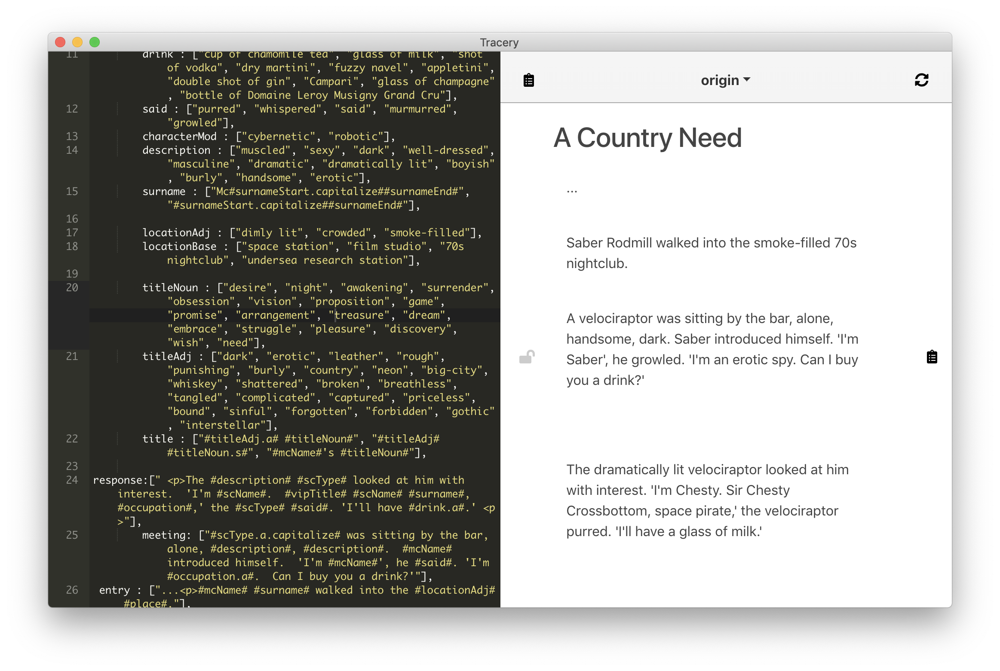

# Tracery.app

This is a simple desktop editor/IDE for [Tracery](https://github.com/galaxykate/tracery).

As you edit your Tracery grammar on the left, it'll live-reload new example texts on the right. 

# Download It!

To download the latest release, go to the [GitHub Releases Tab](https://github.com/lazerwalker/tracery-dot-app/releases) in this repo. Right now, Tracery.app is only available for macOS.

After moving Tracery.app to your Applications folder, you'll need to jump through some security hoops because I haven't yet set up my build process up with Apple codesigning.

Windows and Linux builds are coming very soon. In the meanmwhile, Windows/Linux users can follow the development setup instructions below to build your own copy of the app.

# Current Status

It's very early prerelease! Please open issues or tweet at me (https://twitter.com/lazerwalker) if you encounter any issues. I'm particularly interested in feedback about Windows or Linux builds, as I've only really tested on macOS.

Some features include:

* File saving/loading (wow!)
* Automatically generate new text phrases when you stop typing (or press Cmd+R/Ctrl+R)
* If your Tracery grammar generates HTML, we'll render that as HTML
* Click the 'lock' icon over any individual generated text to prevent it from being written over when you regenerate examples
* The clipboard icon next to any individual text, or the overall one, will copy the text to the clipboard
* You can click the down arrow on the right-side menubar to change which node name is the root node to generate from.

**WARNING**: This app is incredibly insecure (there are specific issues with how I'm not sandboxing user input) that means you should be very careful pasting in any Tracery grammar code you did not write yourself. This is fine for my current personal use case, but caveat emptor. Follow https://github.com/lazerwalker/tracery-dot-app/issues/1 for more info.

## Contributing

Contributions are welcome!

To get a dev environment up and running:

1. Clone this repo
2. Yarn install
3. `electron-forge start` will spin up a dev copy of the app with an inspector attached.
4. `electron-forge make` will compile you a full generated app binary for your current platform.

For more info on dev tooling, check out the [Electron Forge documentation](http://electronforge.io)

## License

This project is licensed under the MIT License. See the LICENSE file in this repo for more information.

## Contact Info

https://github.com/lazerwalker
https://twitter.com/lazerwalker